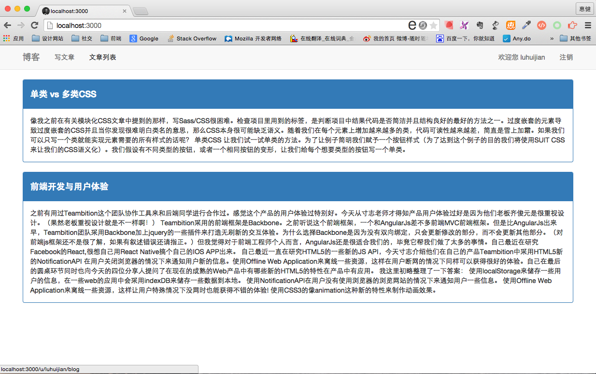

## node.js实现多人博客  
> 基于express@4.12 jade mongoose(Mongdodb)的个人博客程序。  

  


## 安装流程  
* 安装node  
* 安装MongoDB  
  
```js
  npm install mongodb  
```  
* 安装依赖文件

```js
npm install
bower install
```
* 命令行启动服务  

```js
npm start
```
* 在浏览器里面输入`localhost:3000/`  

## 实现功能  
* 多人的登录注册(实现登录注册后才可进行下一步操作)
* 发布文章，给文章添加标签
* 编辑更新文章
* 首页查看用户的所有文章