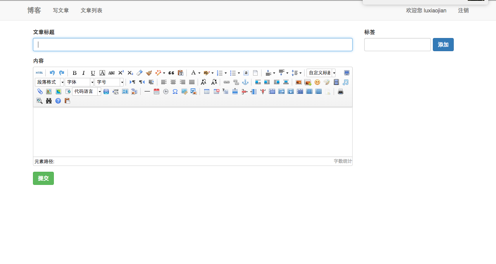

## node.js实现多人博客  

[](https://greenkeeper.io/)
> 基于express@4.12 jade mongoose(Mongdodb)的个人博客程序。  

  


## 安装流程  
* 安装node  
* 安装MongoDB  
  
```js
  npm install mongodb  
```  
* 安装依赖文件

```js
npm install
bower install
```
* 命令行启动服务  

```js
npm start
```
* 在浏览器里面输入`localhost:3000/`  

## 实现功能  
* 多人的登录注册(实现登录注册后才可进行下一步操作)
* 发布文章，给文章添加标签
* 编辑更新文章
* 首页查看用户的所有文章

## 集成Ueditor编辑器



> uediotr没有官方没有集成好现成的nodejs的包，我这边从php的版本修改过来。

### 实现过程 
 
* [现在最新的php的版本](http://ueditor.baidu.com/website/download.html)
* 解压重新命名为ueditor,删除文件php里面所有内容
* 前端视图模板中引入`ueditor.config.js`,`ueditor.all.min.js`,`zh-cn.js`  


注：我的前端模板引擎用的是jade

```jade
    script(src="/ueditor/ueditor.config.js")
    script(src="/ueditor/ueditor.all.min.js")
    script(src="/ueditor/lang/zh-cn/zh-cn.js")
```
* 在需要引入文本编辑器的地方引入  

```js
script#editor(name="blog[blogbody]" type="text/plain")
```
然后写一段脚本初始化并且把它引入文档中

```js
$(function(){
  var ue = UE.getEditor('editor');
})
```
这样就可以在前端把Ueditor引入了，但是因为后端没有配置，所以还不能用。下面来完善后端功能。

* 在[npm](https://www.npmjs.com/)有人写了ueditor的node版本[ueditor-nodejs](https://www.npmjs.com/package/ueditor-nodejs),后端就这就用来这个哥们的组件，在你的app.js中引入下面这段代码即可。

```js
var ueditor = require('ueditor-nodejs');
app.use('/ueditor/ue', ueditor({//这里的/ueditor/ue是因为文件件重命名为了ueditor,如果没改名，那么应该是/ueditor版本号/ue
  configFile: '/ueditor/nodejs/config.json',//ueditor里面里面新建nodejs文件夹，然后写一个config.json的配置文件
  mode: 'bcs', //本地存储填写local
  accessKey: 'Adxxxxxxx',//本地存储不填写，bcs填写
  secrectKey: 'oiUqt1VpH3fdxxxx',//本地存储不填写，bcs填写
  staticPath: path.join(__dirname, 'public'), //一般固定的写法，静态资源的目录，如果是bcs，可以不填
  dynamicPath: '/blogpicture' //动态目录，以/开头，bcs填写buckect名字，开头没有/.路径可以根据req动态变化，可以是一个函数，function(req) { return '/xx'} req.query.action是请求的行为，uploadimage表示上传图片，具体查看config.json.
}));
```
这里我还在ueditor里面里面新建nodejs文件夹，然后写一个config.json的配置文件，下面是我config.json的内容

```json
/* 前后端通信相关的配置,注释只允许使用多行方式 */
{
  /* 上传图片配置项 */
  "imageActionName": "uploadimage", /* 执行上传图片的action名称 */
  "imageFieldName": "upfile", /* 提交的图片表单名称 */
  "imageMaxSize": 2048000, /* 上传大小限制，单位B */
  "imageAllowFiles": [".png", ".jpg", ".jpeg", ".gif", ".bmp"], /* 上传图片格式显示 */
  "imageCompressEnable": true, /* 是否压缩图片,默认是true */
  "imageCompressBorder": 1600, /* 图片压缩最长边限制 */
  "imageInsertAlign": "none", /* 插入的图片浮动方式 */
  "imageUrlPrefix": "", /* 图片访问路径前缀 */
  "imagePathFormat": "/ueditor/php/upload/image/{yyyy}{mm}{dd}/{time}{rand:6}", /* 上传保存路径,可以自定义保存路径和文件名格式 */
  /* {filename} 会替换成原文件名,配置这项需要注意中文乱码问题 */
  /* {rand:6} 会替换成随机数,后面的数字是随机数的位数 */
  /* {time} 会替换成时间戳 */
  /* {yyyy} 会替换成四位年份 */
  /* {yy} 会替换成两位年份 */
  /* {mm} 会替换成两位月份 */
  /* {dd} 会替换成两位日期 */
  /* {hh} 会替换成两位小时 */
  /* {ii} 会替换成两位分钟 */
  /* {ss} 会替换成两位秒 */
  /* 非法字符 \ : * ? " < > | */
  /* 具请体看线上文档: fex.baidu.com/ueditor/#use-format_upload_filename */

  /* 涂鸦图片上传配置项 */
  "scrawlActionName": "uploadscrawl", /* 执行上传涂鸦的action名称 */
  "scrawlFieldName": "upfile", /* 提交的图片表单名称 */
  "scrawlPathFormat": "/ueditor/php/upload/image/{yyyy}{mm}{dd}/{time}{rand:6}", /* 上传保存路径,可以自定义保存路径和文件名格式 */
  "scrawlMaxSize": 2048000, /* 上传大小限制，单位B */
  "scrawlUrlPrefix": "", /* 图片访问路径前缀 */
  "scrawlInsertAlign": "none",

  /* 截图工具上传 */
  "snapscreenActionName": "uploadimage", /* 执行上传截图的action名称 */
  "snapscreenPathFormat": "/ueditor/php/upload/image/{yyyy}{mm}{dd}/{time}{rand:6}", /* 上传保存路径,可以自定义保存路径和文件名格式 */
  "snapscreenUrlPrefix": "", /* 图片访问路径前缀 */
  "snapscreenInsertAlign": "none", /* 插入的图片浮动方式 */

  /* 抓取远程图片配置 */
  "catcherLocalDomain": ["127.0.0.1", "localhost", "img.baidu.com"],
  "catcherActionName": "catchimage", /* 执行抓取远程图片的action名称 */
  "catcherFieldName": "source", /* 提交的图片列表表单名称 */
  "catcherPathFormat": "/ueditor/php/upload/image/{yyyy}{mm}{dd}/{time}{rand:6}", /* 上传保存路径,可以自定义保存路径和文件名格式 */
  "catcherUrlPrefix": "", /* 图片访问路径前缀 */
  "catcherMaxSize": 2048000, /* 上传大小限制，单位B */
  "catcherAllowFiles": [".png", ".jpg", ".jpeg", ".gif", ".bmp"], /* 抓取图片格式显示 */

  /* 上传视频配置 */
  "videoActionName": "uploadvideo", /* 执行上传视频的action名称 */
  "videoFieldName": "upfile", /* 提交的视频表单名称 */
  "videoPathFormat": "/ueditor/php/upload/video/{yyyy}{mm}{dd}/{time}{rand:6}", /* 上传保存路径,可以自定义保存路径和文件名格式 */
  "videoUrlPrefix": "", /* 视频访问路径前缀 */
  "videoMaxSize": 102400000, /* 上传大小限制，单位B，默认100MB */
  "videoAllowFiles": [
    ".flv", ".swf", ".mkv", ".avi", ".rm", ".rmvb", ".mpeg", ".mpg",
    ".ogg", ".ogv", ".mov", ".wmv", ".mp4", ".webm", ".mp3", ".wav", ".mid"], /* 上传视频格式显示 */

  /* 上传文件配置 */
  "fileActionName": "uploadfile", /* controller里,执行上传视频的action名称 */
  "fileFieldName": "upfile", /* 提交的文件表单名称 */
  "filePathFormat": "/ueditor/php/upload/file/{yyyy}{mm}{dd}/{time}{rand:6}", /* 上传保存路径,可以自定义保存路径和文件名格式 */
  "fileUrlPrefix": "", /* 文件访问路径前缀 */
  "fileMaxSize": 51200000, /* 上传大小限制，单位B，默认50MB */
  "fileAllowFiles": [
    ".png", ".jpg", ".jpeg", ".gif", ".bmp",
    ".flv", ".swf", ".mkv", ".avi", ".rm", ".rmvb", ".mpeg", ".mpg",
    ".ogg", ".ogv", ".mov", ".wmv", ".mp4", ".webm", ".mp3", ".wav", ".mid",
    ".rar", ".zip", ".tar", ".gz", ".7z", ".bz2", ".cab", ".iso",
    ".doc", ".docx", ".xls", ".xlsx", ".ppt", ".pptx", ".pdf", ".txt", ".md", ".xml"
  ], /* 上传文件格式显示 */

  /* 列出指定目录下的图片 */
  "imageManagerActionName": "listimage", /* 执行图片管理的action名称 */
  "imageManagerListPath": "/ueditor/php/upload/image/", /* 指定要列出图片的目录 */
  "imageManagerListSize": 20, /* 每次列出文件数量 */
  "imageManagerUrlPrefix": "", /* 图片访问路径前缀 */
  "imageManagerInsertAlign": "none", /* 插入的图片浮动方式 */
  "imageManagerAllowFiles": [".png", ".jpg", ".jpeg", ".gif", ".bmp"], /* 列出的文件类型 */

  /* 列出指定目录下的文件 */
  "fileManagerActionName": "listfile", /* 执行文件管理的action名称 */
  "fileManagerListPath": "/ueditor/php/upload/file/", /* 指定要列出文件的目录 */
  "fileManagerUrlPrefix": "", /* 文件访问路径前缀 */
  "fileManagerListSize": 20, /* 每次列出文件数量 */
  "fileManagerAllowFiles": [
    ".png", ".jpg", ".jpeg", ".gif", ".bmp",
    ".flv", ".swf", ".mkv", ".avi", ".rm", ".rmvb", ".mpeg", ".mpg",
    ".ogg", ".ogv", ".mov", ".wmv", ".mp4", ".webm", ".mp3", ".wav", ".mid",
    ".rar", ".zip", ".tar", ".gz", ".7z", ".bz2", ".cab", ".iso",
    ".doc", ".docx", ".xls", ".xlsx", ".ppt", ".pptx", ".pdf", ".txt", ".md", ".xml"
  ] /* 列出的文件类型 */

}

```
* 将ueditor.config.js中的serverURL改为 URL + "ue"

